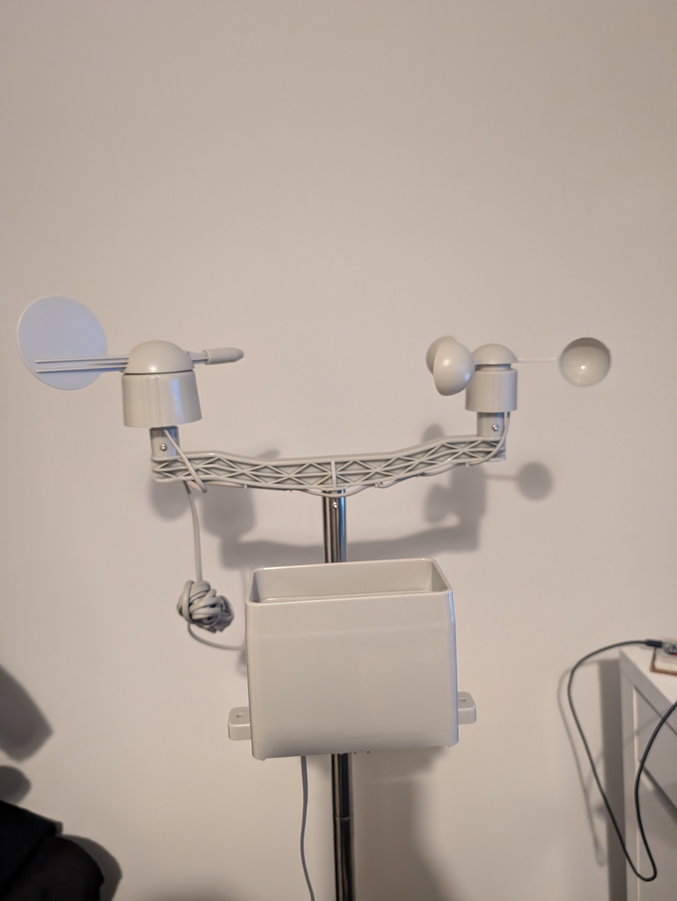

## Arduino Home climate display

---

### The goal of this project is to create an indoor and outdoor climate monitor.
#### The monitor will be build using Arduino and various sensors to display the following:

- **Temperature**
- **Humidity** 
- **Pressure** 
- **Wind Speed**
- **Direction**
- **Rainfall**

These readings will be sent real time wirelessly to a Raspberry Pi which will then give a live display of the readings in a GUI interface. 

---

### Progress

Currently I the SparkFun MicroMod board is set up with the ESP32 prossesor attached and is taking various readings at 10 second intervals and dispaying on a serial printout in the Arduino IDE.  Currently I have set up all sensors on the station to take readings.    They all are published to an MQTT broker and the Pi is able to subscribe to the topics to display the data. Using a Bash script I can test all the data comes through   
I started to work on the Python part of this project which is how I am displaying the data.  I had one script which took the MQTT message and printing to terminal similar to the Bash script, next I started to work on collecting a live updating feed. 

For this I made a script which collected temperature data and created a animated Matplot chart which updates every 10 seconds showing the temperature over the timeframe of about 16 minutes until it starts to rewrite. Today's progress I made a graph for each of the readings and used Matplotlib Sub plot function to bring them all together in one display   

One issue that has come up is powering the device. Using a 2000mAh LiPoly battery it lasts around a day until its drained and paired with a 6W solar panel this proves unable to charge the battery quicker than the board drains it.  For this I am going to try add in the ESP light sleep mode and change the message intervals to every hour or 30 mins with the board in a sleep mode inbetween with the hope this gives the battery enough time to charge to re transmit messages. 

--- 

### Current Equipment 

- **Arduino UNO**
- **Arduino Nano ESP32**
- **Raspberry Pi 5**
- **SparkFun IoT Weather Kit**
- **DHT11 Temperature and Humidity Sensor** 
  
---

### Communication

The data from the outdoor weather station will need to be sent to the Pi inside over a short distance.  The [SparkFun](https://thepihut.com/products/sparkfun-arduino-iot-weather-station) Comes with an ESP32 board so I can use its WiFi capabilities to send the data with the MQTT protocol by setting the the board as publisher and the RaspPi and a subscriber.  To do this I am using the Mosquitto MQTT broker on the Pi. 

---
### Display

Using Tkinter I have created a executable desktop icon that runs the Tkinter GUI module which is connected to the Matplot graphs creating one intergrated display 

