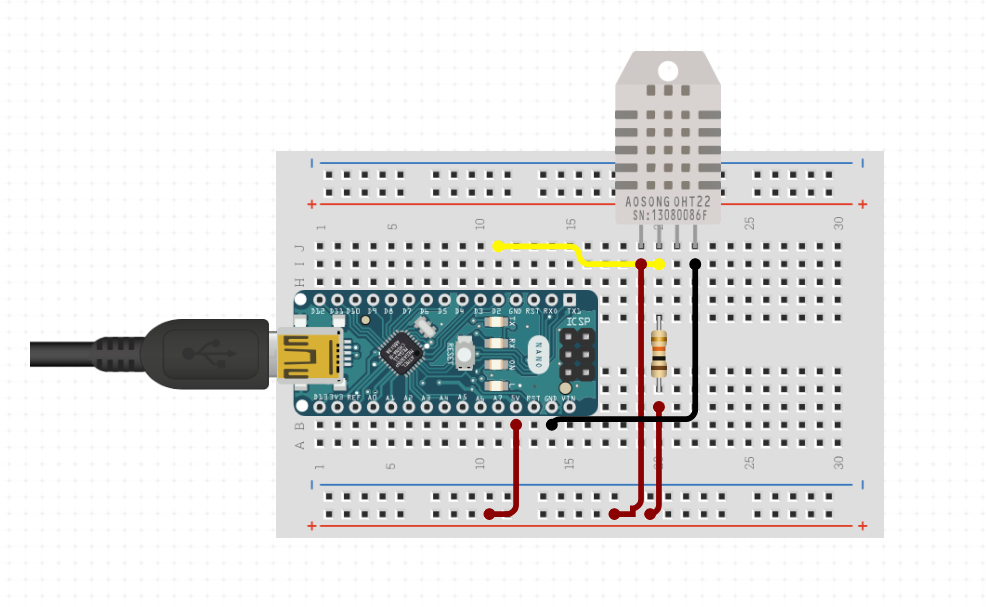

## Arduino Home climate display

---

### The goal of this project is to create an indoor and outdoor climate monitor.
#### The monitor will be build using Arduino and various sensors to display the following:

- **Temperature**
- **Humidity** 
- **Pressure** 
- **Wind Speed**
- **Direction**
- **Rainfall**

#### This readings will be sent real time via a wireless protocol to a Raspberry Pi which will then give a live display of the readings in a GUI interface. 

---

### Progress

Currently I the SparkFun MicroMod board is set up with the ESP32 prossesor attached and is taking various readings at 10 second intervals and dispaying on a serial printout in the Arduino IDE.   I have the weather station set up which just needs connecting and to modify the code to add in the wind and rain data. Previous tests have set up the RasPi with an MQTT broker and can subscribe to the data published by the ESP32.  This has been made in class so currently The Pi still needs to be tested at home on my own Wifi to check all the MQTT messages come through.  Next steps is to finish the set up and to create a Python or C script to sub to all the messages and display with on command.

Example of a previous test using an ESP32 with a DHT11 sensor sending data to the Pi. I opened two terminals to subscribe to the messages, something I am wanting a script to do automatically in one terminal.   
    I have the weather station built and ready to be plugged into the board it came with which includes the ESP32 attachement.   

--- 

### Current Equipment 

- **Arduino UNO**
- **Arduino Nano ESP32**
- **Raspberry Pi 5**
- **SparkFun IoT Weather Kit**
- **DHT11 Temperature and Humidity Sensor**
---

### Communication

The data from the outdoor weather station will need to be sent to the Pi inside over a short distance.  The [SparkFun](https://thepihut.com/products/sparkfun-arduino-iot-weather-station) Comes with an ESP32 board so I can use its WiFi capabilities to send the data with the MQTT protcol by setting the the board as publisher and the RaspPi and a subscriber.  To do this I am using the Mosquitto MQTT broker on the Pi. 

---

### Displaying the data 

Once the pi has the data I am thinking of creating either a Python program to proccess and display using a GUI such as [Flet](https://flet.dev/) and use [MatLab](https://uk.mathworks.com/products/matlab.html) to graph out the data to display in charts for live and trends of climate.  or a second option using the same methods but as a web page running on the Pi. Both have positive and negatives to look into. These are future goals once the station is built and working.

--- 

### Current Wiring diagram 
 *Note the current schematic maker I've used doesnt have a nano ESP32 so the diagram is showing a Nano R3, the rest is the same* 

--- 
### Future goals

- **Set up outside weather station** Set up the station outside, create a waterproof envrionment for the electical parts and upload a sketch to proccess the data and send via MQTT to the Pi for displaying.
- **RasPi GUI** Either using Flet, Figma or another Python GUI module create a way to display the data live on a small home display.
- **Look into Node-RED or WebEx** In my uni IoT module I am going to learning abouw using Node-RED and Webex for IoT devices. This might become a useful tool to use with this project which can help displaying data.
---
### Future extended goals

- **individual room temperature control**  Once the initial setup is complete and working I want to create individual temperature modules that can be placed in each room of my house.  Each room has an electric radiator which I will connect a smart plug too which can be controlled via the Pi or an external app such as home assistance.  Monitoring each room I can choose to turn a radiator on and off by the plug allowing me to set the temperature of specific rooms, for example once I finish work I can turn on the living room radiator and once I am home the room is warm.  I can also create a script that automates this process to turn on and off at certain temperatures. This is because my radiators are old and lack a timer or any controls for this.
